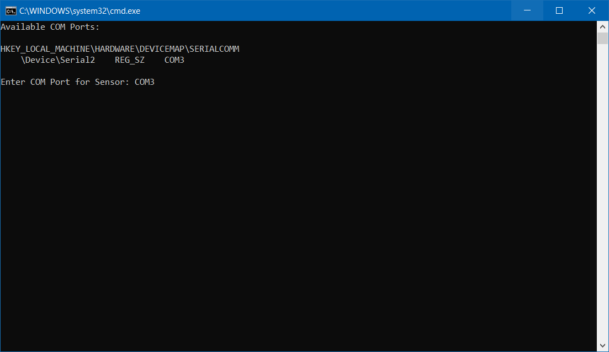
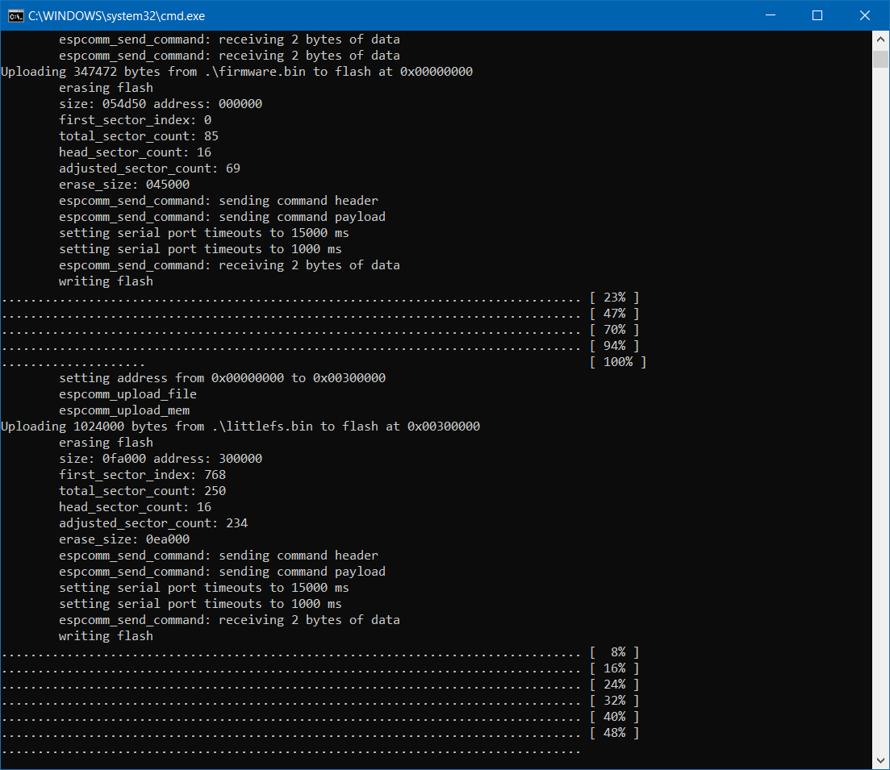

# Firmware and Filesystem Binary Files

Based on your operation system download the coresponding folder with the binary files and flash tool in it. 
Read the eclosed README for further instructions on flashing the firmware on the Witty Cloud Board.

# Flashing Firmware on Windows

For Flashing the Firmware to your board using Windows, download the content of the folder [windows](./windows). Don't move the files in it to other locations. Execute the `flash-firmware.cmd`. A new cmd Window will be opened and you have to enter the Serial Port your board is connected through. A list of connected Devices is listed for you: 

Then press Enter to start the flash process. This task takes one to three minutes. When the process was successful, the window closes itself automatically. 

Afterwards the board can be disconnected from the computer and the system is ready to use.