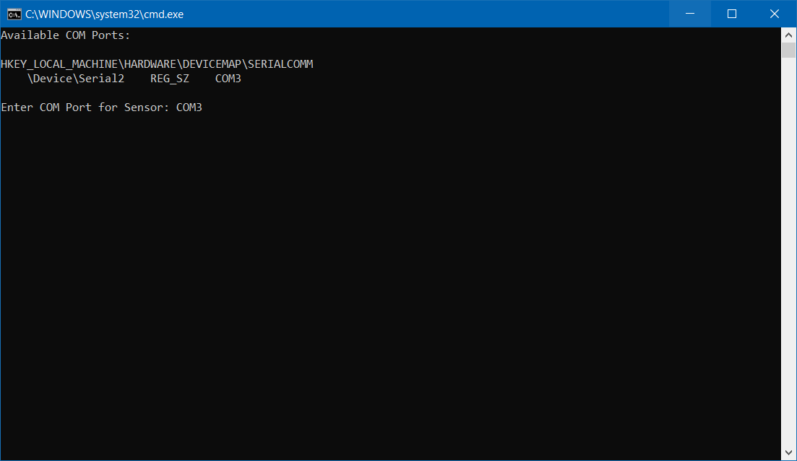
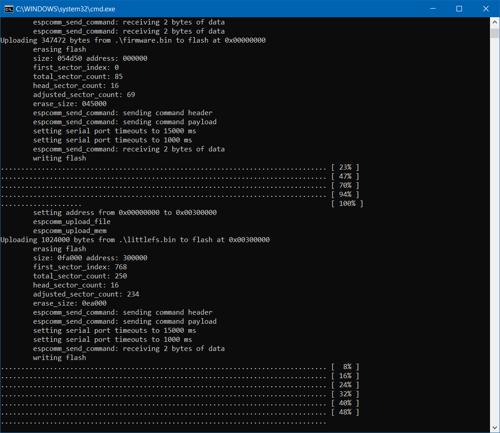

# Firmware and Filesystem Binary Files

Based on your operation system download the coresponding folder with the binary files and flash tool in it. 
Read the eclosed README for further instructions on flashing the firmware on the Witty Cloud Board.

## Flashing Firmware on Windows

For Flashing the Firmware to your board using Windows, 
* Download the [release files from our GitHub Page](https://github.com/iartag/Kuuki/releases) or enter the [windows](./windows) folder. Don't move the files in it to other locations.
* Download the [esptools.exe](https://github.com/igrr/esptool-ck/releases/download/0.4.13/esptool-0.4.13-win32.zip) provided by [igrr](https://github.com/igrr/esptool-ck/releases) and extract it into the windows folder. Such that the `esptools.exe` and `flash-firmware.cmd` is in the same directory.
* Execute the `flash-firmware.cmd`. A new Terminal Window  will be opened and you have to enter the Serial Port your board is connected through. A list of connected Devices is listed for you: 

* Then press Enter to start the flash process. This task takes one to three minutes. When the process was successful, the window closes itself automatically. 

* Afterwards the board can be disconnected from the computer and the system is ready to use.

## Flashing Firmware on macOS

Coming soon

## Flashing Firmware on Linux

Coming soon